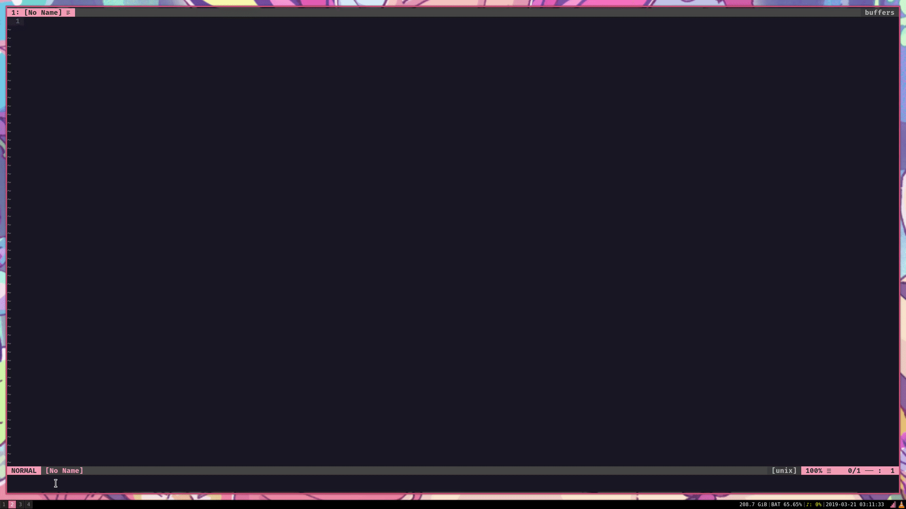
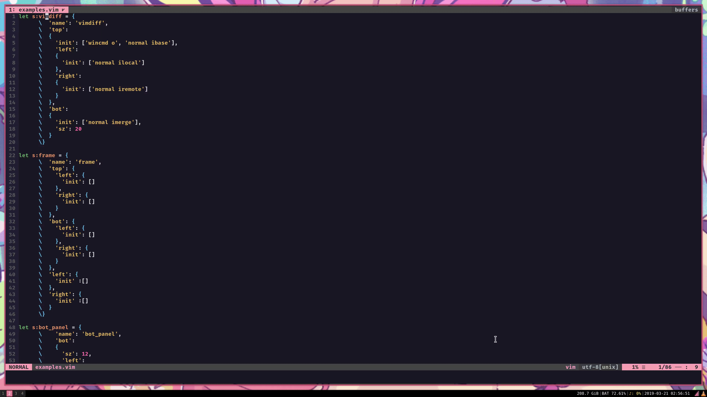
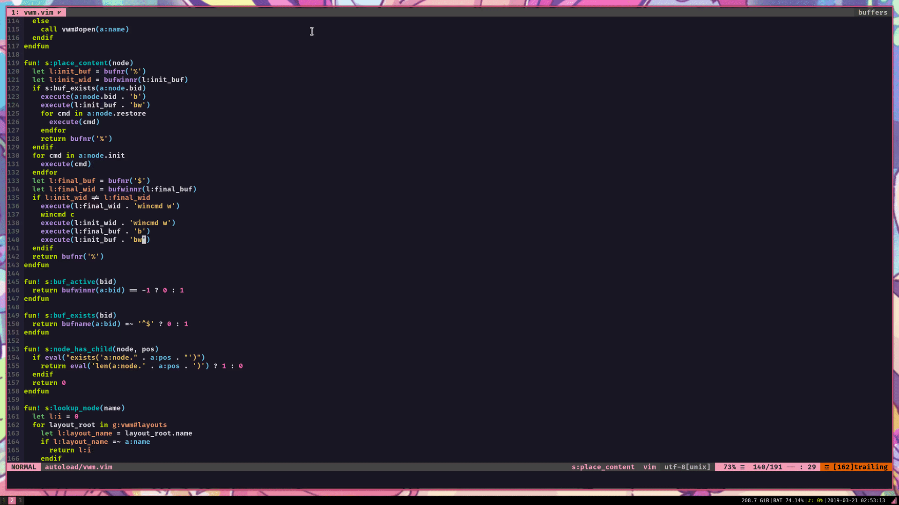

# *V*im *W*indow *M*anager

A layout manager for vim and nvim.

## Features

* Save and manage vim windows via layouts
* Automatically cache and unlist buffers
* Automatically reuse buffers
* Regroup command buffers
* Highly configurable

## Installation

* **vimplug:** `Plug 'paroxayte/vwm.vim'`
* **dein:** `call dein#add('paroxayte/vwm.vim')`
* **manual:** source the this repo to your vim runtime

## Usage

* **Layout on:**      `:VwmOpen *layout_name*`
* **Layout off:**     `:VwmClose *layout_name*`
* **Layout toggle:**  `:VwmToggle *layout_name*`

*note:* `default` *is the only default layout. Test it out!*

## Examples

**_note:_** For detailed configuration see `help: vwm.vim`.
### layouts
**[definitions](./.github/layouts.vim)**

### command buffer regrouping
*vwm can take commands that open a new window, and incorporate that window in to a defined layout*

The following example will make use of the wonderful [NERDTree plugin](https://github.com/scrooloose/nerdtree) and the equally wonderful [Tagbar plugin](https://github.com/majutsushi/tagbar).

**[definitions](./.github/dev_panel.vim)**

